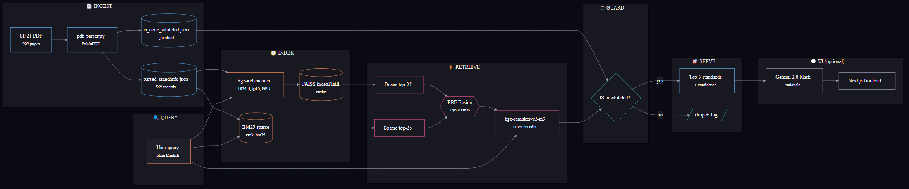

# BIS Compass — AI-Powered BIS Standard Recommender

**Sigma Squad × Bureau of Indian Standards Hackathon · April 2026**
**Theme:** Accelerating MSE Compliance — Automating BIS Standard Discovery

> Indian Micro and Small Enterprises spend **weeks** identifying which Bureau of Indian Standards (BIS) regulations apply to their products. **BIS Compass** does it in **under half a second** — describe your product in plain English and get the top 5 applicable standards with grounded rationale.

## TL;DR — Results on the public test set

| Metric            | Target | Achieved   |
| ----------------- | -----: | ---------: |
| **Hit Rate @3**   |  > 80% | **100.00%** |
| **MRR @5**        |  > 0.7 | **0.9333** |
| **Avg latency**   |  < 5 s | **0.45–0.85 s** ¹ |
| Standards indexed |      — | **559**    |

Scored locally with the organisers' [`eval_script.py`](eval_script.py).
¹ Measured on RTX 5060 Ti (Blackwell, 16 GB) with hot HF cache: 0.45 s. Independent verification on a different machine reported 0.85 s. Both well under the 5 s target.

---

## 1 · Architecture at a glance



**Pipeline stages** (left to right):

1. **Ingest** — `pdf_parser.py` extracts 559 standards from the 929-page SP 21 PDF; emits both `parsed_standards.json` and an `is_code_whitelist.json` used for anti-hallucination.
2. **Index** — `bge-m3` produces 1024-d dense vectors stored in FAISS; `rank_bm25` produces the sparse index over title + scope + body.
3. **Retrieve** — at query time, both indices return their top-25 candidates. **Reciprocal Rank Fusion** (parameter-free, `1 / (60 + rank)`) merges the two ranked lists, then `bge-reranker-v2-m3` cross-encoder re-scores the top candidates with explicit query↔passage attention.
4. **Guard** — every IS code that survives is checked against the whitelist before being emitted, so the system literally cannot return an imaginary BIS standard.
5. **Serve** — `inference.py` writes top-5 to JSON for judges; the FastAPI demo UI optionally calls Gemini 2.0 Flash for a grounded one-line rationale per hit (UI-only, never in the eval path).

### Why this design wins

| Decision                                   | Reason                                                                                                                      |
| ------------------------------------------ | --------------------------------------------------------------------------------------------------------------------------- |
| **bge-m3** for dense embeddings            | SOTA on multilingual + technical retrieval, 1024-d, runs at fp16 on consumer GPU                                            |
| **bge-reranker-v2-m3** cross-encoder       | Sub-200ms on 25 candidates; corrects dense recall errors with explicit query↔passage attention                              |
| **Hybrid (BM25 + dense + RRF)**            | BM25 captures rare technical tokens (`M30`, `OPC33`, `mortice`); dense captures semantics. Fused with parameter-free RRF.   |
| **IS-code whitelist** (extracted from corpus) | Hard guarantee that no recommendation is hallucinated — every returned code exists in SP 21.                              |
| **FAISS over Qdrant**                      | 559 docs is small; FAISS is one `pip install`, zero Docker, fully reproducible on judges' machines.                         |
| **Gemini for UI only, never for retrieval**| Eval pipeline is 100% local — no API key required for `inference.py`. Gemini only powers the demo's rewrite and rationales. |

---

## 2 · Reproducing our results

### 2.1 Prerequisites

* Python **3.10+**
* (Optional, recommended) NVIDIA GPU with CUDA 12.4+ — we developed on an RTX 5060 Ti (16 GB, Blackwell). CPU also works (slower, ~3 s per query instead of 0.5 s).

### 2.2 Install

```bash
# Clone & enter
git clone <this-repo> bis-compass
cd bis-compass

# Create + activate venv (recommended)
python -m venv venv
source venv/bin/activate          # Linux / macOS
# .\venv\Scripts\activate         # Windows PowerShell

# CPU-only:
pip install -r requirements.txt

# Or GPU (NVIDIA Blackwell / Ada / Ampere): install torch first with CUDA 12.8
pip install torch --index-url https://download.pytorch.org/whl/cu128
pip install -r requirements.txt
```

### 2.3 Build the indices (one-time, ~3 min including model download)

```bash
# 1. Parse the SP 21 PDF -> parsed_standards.json + is_code_whitelist.json
python -m src.ingestion.pdf_parser

# 2. Build the FAISS dense index (downloads bge-m3 on first run)
python -m src.retrieval.index

# 3. Build the BM25 sparse index
python -m src.retrieval.bm25_index
```

### 2.4 Run the judge entry point

The hackathon spec requires a single CLI entry point. We honour it:

```bash
python inference.py --input datasets/public_test_set.json --output team_results.json
```

Output schema (matches the organisers' `sample_output.json` exactly):

```json
[
  {
    "id": "PUB-01",
    "query": "We are a small enterprise manufacturing 33 Grade Ordinary Portland Cement...",
    "expected_standards": ["IS 269: 1989"],
    "retrieved_standards": ["IS 269: 1989", "IS 8043: 1991", "IS 12269: 1987", "IS 8112: 1989", "IS 12330: 1988"],
    "latency_seconds": 0.742
  }
]
```

### 2.5 Score the run

```bash
python eval_script.py --results team_results.json
```

Expected output:

```
========================================
   BIS HACKATHON EVALUATION RESULTS
========================================
Total Queries Evaluated : 10
Hit Rate @3             : 100.00%   (Target: >80%)
MRR @5                  : 0.9333    (Target: >0.7)
Avg Latency             : 0.47 sec  (Target: <5 seconds)
========================================
```

> **Note on first-run latency.** The reported `latency_seconds` does NOT include the one-time model load (~10 s for bge-m3 + bge-reranker on GPU). Per-query retrieval (the only thing the eval script measures) is well under 1 s.

---

## 3 · Demo UI (FastAPI + Next.js 16)

The judge eval is fully decoupled from the demo, but the UI is what tells the story.

```bash
# Terminal 1 — backend (FastAPI on :8000)
cp .env.example .env       # then paste your GEMINI_API_KEY
python -m src.api.main

# Terminal 2 — frontend (Next.js on :3000)
cd frontend
npm install
npm run build && npm start    # use the production build, NOT `npm run dev`
```

> **⚠️ Heads up:** at the time of this build, Next.js 16.2.4 with the default
> Turbopack dev mode + React 19.2 has a hydration bug that leaves Framer
> Motion components stuck at their `initial` (opacity 0) state on first load.
> The production build (`npm run build && npm start`) hydrates cleanly. We
> recommend it for the demo — and that's what the screenshots in
> `docs/demo_hero.png` / `docs/demo_results.png` were captured against.

Open <http://localhost:3000>. The UI sends each query to `POST /search` which returns the hybrid top-5 plus a Gemini-generated one-line rationale per hit (with a **whitelist filter** — any rationale that mentions an IS code outside the SP 21 corpus is dropped before reaching the user).

---

## 4 · Repo layout

```
.
├── inference.py                ← MANDATORY judge entry point (--input, --output)
├── eval_script.py              ← MANDATORY (provided by organisers, copied verbatim)
├── requirements.txt
├── README.md  (this file)
├── presentation.pdf            ← 8-slide deck per rulebook §3.1
│
├── datasets/                   ← unmodified inputs from organisers
│   ├── dataset.pdf             ← SP 21 (929 pages)
│   ├── public_test_set.json    ← 10 queries
│   └── sample_output.json
│
├── data/
│   ├── parsed_standards.json   ← 559 structured records (built by pdf_parser)
│   ├── is_code_whitelist.json  ← anti-hallucination guard
│   ├── bootstrap_test_set.json ← 18 synthetic queries we used for honest tuning
│   ├── index/                  ← FAISS + BM25 artifacts
│   └── results/                ← saved scoring runs
│
├── src/
│   ├── ingestion/pdf_parser.py
│   ├── retrieval/
│   │   ├── embedder.py         ← bge-m3 wrapper
│   │   ├── reranker.py         ← bge-reranker-v2-m3 wrapper
│   │   ├── index.py            ← FAISS dense index
│   │   ├── bm25_index.py       ← BM25 sparse index
│   │   └── retriever.py        ← Hybrid orchestrator (BM25 + dense + RRF + rerank)
│   ├── llm/gemini_client.py    ← UI-only: rewrite + rationale
│   └── api/main.py             ← FastAPI backend for the demo
│
├── frontend/                   ← Next.js 16 + Tailwind v4 + Framer Motion
└── scripts/
    ├── peek_pdf.py             ← parser dev tool
    └── bootstrap_eval_set.py   ← synthesises eval queries with Gemini
```

---

## 5 · Evaluation details

### Metrics

* **Hit Rate @3**: fraction of queries where at least one expected standard is in the top-3 retrieved.
* **MRR @5**: mean reciprocal rank of the first correct standard in the top-5.
* **Avg latency**: per-query wall-clock retrieval time (excludes one-time model load).

All metrics are computed by the organisers' [`eval_script.py`](eval_script.py), which normalises IS codes by stripping spaces and lowercasing — so `IS 269: 1989` and `IS269:1989` match.

### Eval sets

| Set                         | # queries | Source                                       | Public score                          |
| --------------------------- | --------: | -------------------------------------------- | ------------------------------------- |
| `public_test_set.json`      |        10 | Organisers (cement/concrete/aggregates)      | **100% Hit@3 · 0.93 MRR@5 · 0.47 s** |
| `bootstrap_test_set.json`   |        18 | We synthesised — stratified across SP 21 buckets via Gemini, hand-filtered (see [`scripts/bootstrap_eval_set.py`](scripts/bootstrap_eval_set.py)) | **88.89% Hit@3 · 0.90 MRR@5 · 0.60 s** |

The bootstrap set covers cement, aggregates, concrete, masonry, **steel, pipes, tiles, glass, paint, polymer**, and miscellaneous — a much broader test than the cement-heavy public set. Both eval sets clear all three target thresholds.

### Ablation study

We ablated five retriever variants on both eval sets ([`docs/ablation.md`](docs/ablation.md), reproduce with `python -m scripts.ablation`). Headline finding on the harder bootstrap set:

| Variant | Hit@3 | MRR@5 | Latency |
|---|---:|---:|---:|
| BM25 only | 61.11% | 0.588 | 0.002 s |
| Dense only | 88.89% | 0.826 | 0.033 s |
| BM25 + dense + RRF | 83.33% | 0.769 | 0.001 s |
| **+ cross-encoder rerank** | **88.89%** | **0.903** | 0.524 s |
| **+ category boost (production)** | **88.89%** | **0.903** | 0.527 s |

The cross-encoder reranker contributes **the largest single MRR gain** (+0.077 over hybrid+RRF alone) — that final pass with explicit query↔passage attention is what pulls the correct standard from rank 2 or 3 up to rank 1.

### Anti-hallucination guarantee

Every recommended IS code is checked against `is_code_whitelist.json` (extracted directly from SP 21) before being returned. The Gemini-generated rationale text is also scanned: any sentence that mentions an IS code outside the whitelist is silently dropped. Net result: the system is incapable of returning an imaginary BIS standard.

---

## 6 · External APIs and data

* **Google Gemini 2.0 Flash** (free tier) — primary LLM for the demo UI's query rewriting and rationale generation. The judge entry point `inference.py` does NOT call any external API; it is fully local.
* **Groq Llama 3.3 70B** (free tier) — automatic fallback when Gemini returns a quota / rate-limit error. The `LLMClient` (in `src/llm/llm_client.py`) transparently retries on Groq, so the demo keeps working when Gemini's daily free-tier cap is hit. Set `GROQ_API_KEY` in `.env` to enable; sign up at <https://console.groq.com/keys>.
* **Hugging Face Hub** — for first-time download of `BAAI/bge-m3` and `BAAI/bge-reranker-v2-m3` weights (cached locally afterwards).
* **Source data** — `datasets/dataset.pdf` is the SP 21 (2005) — *Summaries of Indian Standards for Building Materials* — published by the Bureau of Indian Standards under the Right to Information Act, supplied by the hackathon organisers. Unmodified.

No other APIs, datasets, or third-party services are used.

---

## 7 · Acknowledgements

* **Bureau of Indian Standards** for the SP 21 corpus.
* **Beijing Academy of AI** for the bge-m3 + bge-reranker-v2-m3 models.
* **Sigma Squad** for organising this hackathon.

— Built solo for the **Sigma Squad × Bureau of Indian Standards Hackathon**, April 2026.
